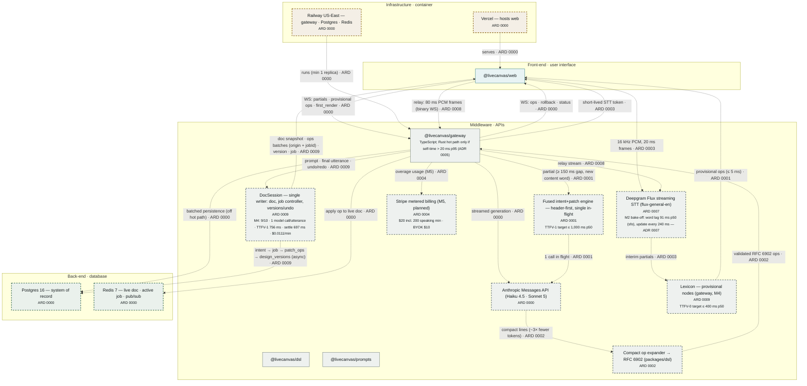
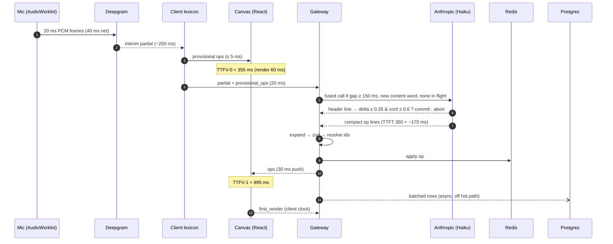
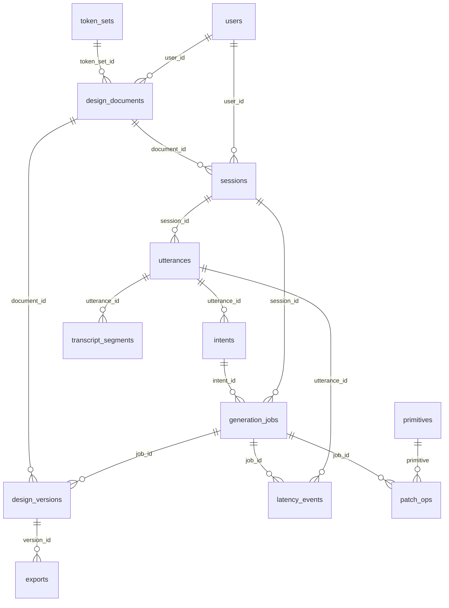
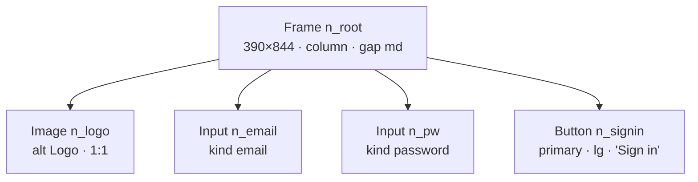

# Architecture — LiveCanvas

**Standard.** Components stay minimal and repetitive. Before adding a component, prove that
no existing one can be extended to do the job, and write that proof into section 6. Every
generated block below is derived from the code by `/arch` (ERD, components, sprawl, features
from `.claude/decisions/*` ```` ```arch ```` blocks) — never edit one by hand. Module-level
detail from the TypeScript AST lives in [`docs/CODEMAP.md`](docs/CODEMAP.md) (`pnpm codemap`).
`pnpm arch:check` fails CI if either is stale.

## 1. What this system is

LiveCanvas turns speech into a UI design while the speaker is still talking: a designer or
PM says "a login screen with email and password, big blue sign-in button, logo on top" and
sees a phone frame, inputs and a button appear before the sentence ends. The one constraint
that shapes everything is **latency**: first visible change ≤ 400 ms p50 after the words
(TTFV-0), first model-quality change ≤ 1,000 ms p50 (TTFV-1), at ≤ $0.046 per speaking
minute so a $20/month plan stays profitable. Hence: edits are tiny RFC 6902 patches (never
full regeneration), an instant client-side lexicon tier runs before any model, one model call
is in flight at a time, and nothing on the hot path waits on Postgres.

## 2. Products and features

Generated from the ```` ```arch ```` blocks in `.claude/decisions/`. Every feature here was
declared by an ARD, so the map and the decision log can never disagree.

```mermaid
flowchart LR
  subgraph features["Products &amp; features"]
    direction TB
    F_voice_design["Live voice design session<br/><small>ARD 0000</small>"]
    F_documents["Design documents · versions · undo<br/><small>ARD 0000</small>"]
    F_vocabulary["Component vocabulary &amp; themes<br/><small>ARD 0000</small>"]
    F_accounts["Accounts (magic link)<br/><small>ARD 0000</small>"]
    F_export["Export — React · HTML · PNG · URL (M6)<br/><small>ARD 0000</small>"]
    F_latency["Latency telemetry &amp; HUD<br/><small>ARD 0001</small>"]
    F_billing["Plans · quota · BYOK (M5, planned)<br/><small>ARD 0004</small>"]
    F_documents["Design documents · versions · undo<br/><small>ARD 0009</small>"]
  end
  subgraph uses["Components"]
    direction TB
    C__livecanvas_dsl["@livecanvas/dsl"]
    C__livecanvas_gateway["@livecanvas/gateway"]
    C__livecanvas_web["@livecanvas/web"]
    C_anthropic["Anthropic Messages API (Haiku 4.5 · Sonnet 5)"]
    C_doc_session["DocSession — single writer: doc, job controller, versions/undo"]
    C_postgres["Postgres 16 — system of record"]
    C_redis["Redis 7 — live doc · active job · pub/sub"]
    C_stripe["Stripe metered billing (M5, planned)"]
  end
  subgraph owned["Tables owned"]
    direction TB
    T_design_documents[("design_documents")]
    T_design_versions[("design_versions")]
    T_exports[("exports")]
    T_generation_jobs[("generation_jobs")]
    T_intents[("intents")]
    T_latency_events[("latency_events")]
    T_patch_ops[("patch_ops")]
    T_plans[("plans")]
    T_primitives[("primitives")]
    T_provider_keys[("provider_keys")]
    T_sessions[("sessions")]
    T_token_sets[("token_sets")]
    T_transcript_segments[("transcript_segments")]
    T_usage_periods[("usage_periods")]
    T_users[("users")]
    T_utterances[("utterances")]
  end
  F_voice_design --> C__livecanvas_web
  F_voice_design --> C__livecanvas_gateway
  F_voice_design --> C_anthropic
  F_voice_design --> C_redis
  F_voice_design ==>|owns| T_sessions
  F_voice_design ==>|owns| T_utterances
  F_voice_design ==>|owns| T_transcript_segments
  F_voice_design ==>|owns| T_intents
  F_voice_design ==>|owns| T_generation_jobs
  F_voice_design ==>|owns| T_patch_ops
  F_documents --> C__livecanvas_gateway
  F_documents --> C_postgres
  F_documents ==>|owns| T_design_documents
  F_documents ==>|owns| T_design_versions
  F_vocabulary --> C__livecanvas_dsl
  F_vocabulary ==>|owns| T_primitives
  F_vocabulary ==>|owns| T_token_sets
  F_accounts --> C__livecanvas_gateway
  F_accounts --> C_redis
  F_accounts --> C_postgres
  F_accounts ==>|owns| T_users
  F_export --> C__livecanvas_gateway
  F_export ==>|owns| T_exports
  F_latency --> C__livecanvas_web
  F_latency --> C__livecanvas_gateway
  F_latency ==>|owns| T_latency_events
  F_billing --> C__livecanvas_web
  F_billing --> C__livecanvas_gateway
  F_billing --> C_stripe
  F_billing --> C_postgres
  F_billing ==>|owns| T_plans
  F_billing ==>|owns| T_usage_periods
  F_billing ==>|owns| T_provider_keys
  F_documents --> C_doc_session
  F_documents --> C_postgres
  F_documents ==>|owns| T_design_documents
  F_documents ==>|owns| T_design_versions
  classDef feat fill:#e8f3f4,stroke:#1F6F78,color:#12191B;
  classDef comp fill:#eef1ef,stroke:#5A686C,color:#12191B;
  classDef tab fill:#eaf1ec,stroke:#2C6249,color:#12191B;
  class F_voice_design,F_documents,F_vocabulary,F_accounts,F_export,F_latency,F_billing,F_documents feat;
  class C__livecanvas_dsl,C__livecanvas_gateway,C__livecanvas_web,C_anthropic,C_doc_session,C_postgres,C_redis,C_stripe comp;
  class T_design_documents,T_design_versions,T_exports,T_generation_jobs,T_intents,T_latency_events,T_patch_ops,T_plans,T_primitives,T_provider_keys,T_sessions,T_token_sets,T_transcript_segments,T_usage_periods,T_users,T_utterances tab;
```

<!-- arch:begin:features -->

<!-- arch:end:features -->

### 2.1 Live voice design session — ADR 0000, 0001, 0003
Uses `@livecanvas/web` (mic, client lexicon, canvas), Deepgram, `@livecanvas/gateway`
(fused engine, job controller), Anthropic, Redis. **Owns** `sessions`, `utterances`,
`transcript_segments`, `intents`, `generation_jobs`, `patch_ops`. This is the hot path;
every other feature reads from it, never writes into it.

### 2.2 Design documents · versions · undo — ADR 0000
Uses `@livecanvas/gateway` + Postgres. **Owns** `design_documents`, `design_versions`.
Reads `generation_jobs` (a successful job creates one version, D12).

### 2.3 Component vocabulary & themes — ADR 0000
Uses `@livecanvas/dsl`. **Owns** `primitives`, `token_sets`. Source of truth is the zod code
in `packages/dsl`; the tables are seeded from it (see finding F2).

### 2.4 Latency telemetry & HUD — ADR 0001
Uses web (client-measured TTFV, reflow observer) + gateway (stage events). **Owns**
`latency_events`. Reads `generation_jobs`, `utterances`.

### 2.5 Accounts — ADR 0000
Magic-link auth. **Owns** `users`. Link tokens live in Redis (15-min TTL), not a table.

### 2.6 Export (M6) — ADR 0000
**Owns** `exports`. Reads `design_versions`.

### 2.7 Plans · quota · BYOK (M5, planned) — ADR 0004
Will **own** `plans`, `usage_periods` (FK → users, plans), `provider_keys` (FK → users,
encrypted). Speaking minutes are derived from `transcript_segments` — no new telemetry.

## 3. Component inventory

<!-- arch:begin:counts -->
| Measure | Count |
|---|---|
| Components | 4 |
| Tables | 13 |
| Foreign keys | 16 |
| Tables with no FK either way | 0 |
| Distinct error types | 1 |
| Symbol names defined 3+ times | 0 |
| ARDs on record | 11 (11 contributing to the diagram) |
| Components declared by ARDs | 11 |
| Features declared by ARDs | 8 |
<!-- arch:end:counts -->

| Component | Layer | Owns | Pattern (§6) |
|---|---|---|---|
| `@livecanvas/web` — canvas renderer, Zustand doc store, playground | Front-end | Rendering of the 12 primitives; client doc copy | P3 registry, P5 memo-by-id, P2 patch |
| Lexicon (M4, `packages/dsl`, runs in gateway — ADR 0009) | Middleware | Provisional ops from partials | P2 patch |
| `DocSession` (`apps/gateway/src/engine`) | Middleware | The live doc (single writer), job controller, versions/undo | P2 patch, P1 at the WS boundary |
| `@livecanvas/dsl` — contracts, applier, compact expander, delta score | Middleware (shared) | Every schema and the one patch implementation | P1 schema+type, P2 patch, P3 registry |
| `@livecanvas/prompts` — prompt loader | Middleware | Static-prefix / template split | P4 validated config |
| `@livecanvas/gateway` — Fastify + ws | Middleware | Sessions, STT token, fused engine, job controller, persistence | P4 validated config, P1 at the WS boundary |
| Anthropic API | Middleware (external) | Generation | — |
| Deepgram | Middleware (external) | STT partials | — |
| Redis 7 | Back-end | Live doc, active job, pub/sub | — |
| Postgres 16 | Back-end | System of record (ERD §5) | — |
| Docker Compose / Vercel / Railway | Infrastructure | Local stack; web hosting; gateway + data (US-East) | P6 generated + checked |

## 4. System architecture — living

One diagram, grown one decision at a time. **Solid** boxes were discovered in the code.
**Dashed** boxes and dotted edges were declared by an ARD and carry its number.

<!-- arch:begin:components -->

<!-- arch:end:components -->

### 4.1 One utterance, end to end (hand-maintained; ADR 0001 estimates — M0 measured STT 502 ms, first op 788 ms)



### 4.2 Throughput per speaking user (derived; M0/M4 replace estimates)

| Flow | Rate | Derivation |
|---|---|---|
| Audio browser → Deepgram | 256 kbps, 50 frames/s × 640 B | 16,000 samples/s × 2 B = 32,000 B/s |
| Deepgram interim partials | ~4/s | ~250 ms interim cadence (estimate) |
| Client → gateway partial msgs | ≤ 4/s | one per partial |
| Model calls | **≤ 20/min** (0.33/s) | D16 cost ceiling; single in-flight |
| Model tokens | ≤ 22k in + 1.2k out per min | 20 × 1,100 in; 20 × 60 out |
| Ops pushed gateway → client | ~1/s | ~3 ops per committed call |
| Redis writes | ~1.3/s | model ops + provisional ops |
| Postgres rows | ~540/min, ~20 batched inserts/min | 240 segments + 20 intents + 20 jobs + 60 ops + 200 latency events |
| Postgres growth | ~108 KB per speaking min → ~7.6 MB/user/mo | 540 rows × ~200 B; 70 min typical |

### 4.3 Capacity at scale (assumes 10% of users in a session at peak, 35% of that time talking)

| Paying users | Concurrent sessions | Concurrent speakers | Model RPM | Input TPM | Output TPM | Gateway vCPU (≥ 200 sessions/vCPU) |
|---|---|---|---|---|---|---|
| 100 | 10 | 3.5 | 70 | 77k | 4.2k | 1 |
| 1,000 | 100 | 35 | 700 | 770k | 42k | 1 |
| 10,000 | 1,000 | 350 | 7,000 | 7.7M | 420k | 5 |

Model RPM = speakers × 20; input TPM = speakers × 22k; output TPM = speakers × 1.2k.
Check the org's Anthropic rate-limit tier and Deepgram concurrent-stream limit against the
row you plan to reach — both are account-specific.

### 4.4 Thresholds (a breach is a failing change)

| Metric | Target p50 | Target p95 | **M0 measured p50** | Fails when | Measured by |
|---|---|---|---|---|---|
| TTFV-0 — first visible change | ≤ 400 ms | ≤ 600 ms | M0 607 ms ❌ → **M4 −192 ms ✅** (browser 168–620) | p50 regresses > 15% | client: Deepgram word-end → render |
| TTFV-1 — first model change | ≤ 1,000 ms | ≤ 1,500 ms | M0 1,515 ms ❌ → **M4 756 ms ✅** (browser 862–1,349) | p50 regresses > 15% | client: word-end → render of model op |
| STT word-end → partial | ≤ 295 ms | — | 502 ms Nova-3 ❌ → **91 ms Flux ✅** (ADR 0007) | — | bake-off / client |
| Haiku first valid op | ≤ 640 ms | — | **788 ms** | — | spike / `latency_events` first_op |
| Settle after speech stops | ≤ 1,200 ms | ≤ 2,000 ms | **M4 697 ms ✅** | p50 > 1,500 ms | `latency_events` final → settled |
| Reflows per element per utterance | < 3 | — | **M4 1 ✅** (harness + on-screen bbox) | ≥ 3 in > 2/10 runs | ResizeObserver, bbox move > 4 px |
| React commit, 1 op on 200-node doc | < 16 ms | — | — (M3) | ≥ 16 ms | React Profiler |
| Model op validity | ≥ 98% | — | **100% ✅** | < 98% | zod on expanded ops |
| Cost per speaking minute | ≤ $0.046 | — | M0 $0.0313 → **M4 $0.0111 ✅** | > $0.015 (+15% on measured) | HUD: tokens × price + STT min |
| Model calls per speaking minute | ≤ 20 | — | **M4 9.6 ✅** | > 23 | `generation_jobs` count |
| Gateway self-time per TTFV-1 | ≤ 20 ms | — | — (M4) | > 20 ms p95 → ADR 0005 Rust trigger | OTel spans |

M0 (ADR 0006): STT is the gating hop — see `docs/LATENCY_BUDGET.md` for per-hop data and the
projected 988 ms TTFV-1 once STT ≤ 200 ms, header compression and gap-free triggering land.

## 5. Backend ERD

Every table and every foreign key, generated from `db/schema.sql`.

<!-- arch:begin:erd -->

<!-- arch:end:erd -->

Schema rules: every table has `id` and `created_at`; JSON lives only in `intent`, `value`,
`doc`, `current_doc`, `tokens`, `prop_schema`; everything else is typed columns.
`latency_events` must reference a job or an utterance (CHECK).

### 5.1 The design AST (DesignDoc) — the other data model

The canvas is an abstract syntax tree; every edit is an RFC 6902 op against it.

```
DesignDoc  := { id, tokens: TokenSetName, root: Node }            -- root.type = Frame
Node       := { id: /n_[a-z0-9_]+/, type: Primitive, props: Props[type],
                provisional?: bool, children?: Node[] }           -- children only on Frame | Stack | Card
Primitive  := Frame | Stack | Text | Button | Input | Image | Icon | Card | List | Nav | Table | Chart
Props[t]   := zod object per primitive (packages/dsl/src/primitives.ts); values are tokens:
              color ∈ primary|secondary|surface|muted|danger|text · space ∈ xs..xl · radius ∈ none|sm|md|full

-- model wire format (ADR 0002), expanded to RFC 6902 by packages/dsl/src/compact.ts
Header     := JSON { a: action, t?: target(s), c: confidence, s?: structural, x?: explicit }
OpLine     := "+" Primitive Alias ">" Ref Prop* Quoted?     → add    …/children/-
            | "~" Ref Prop* Quoted?                         → replace …/props/<k>
            | "-" Ref                                       → remove
            | "^" Ref ">" Ref ("@" Index)?                  → move
Prop       := Key "=" Value      Key ∈ full name | v s c g p d a j r k f w h
Ref        := "root" | NodeId | Alias
```

Example — the definition-of-done utterance as a tree:



## 6. Design patterns we repeat

| # | Pattern | Canonical implementation | Use it when |
|---|---|---|---|
| P1 | **zod schema + same-name inferred type**, defined once in `packages/dsl` | [`tokens.ts`](packages/dsl/src/tokens.ts) (`ColorToken` const + type) | Any contract crossing a boundary: WS message, model output, DB JSON column, env |
| P2 | **Every change is an RFC 6902 op** through `applyOp` / `invertOp` | [`ops.ts`](packages/dsl/src/ops.ts) | Model edits, lexicon edits, undo/redo, abort rollback, theme switch — no other mutation path |
| P3 | **Registry keyed by primitive type** (`Record<PrimitiveType, X>`, `satisfies` enforces all 12) | [`primitives.ts`](packages/dsl/src/primitives.ts) `propSchemas`; [`primitives.tsx`](apps/web/components/canvas/primitives.tsx) `renderers` | Adding per-primitive behaviour (export, lexicon nouns) — add a registry, never a switch |
| P4 | **Validated config with defaults at startup** | [`config.ts`](apps/gateway/src/config.ts) | Any tunable; the HUD sliders write the same keys |
| P5 | **Per-node `memo` keyed by stable node id** | [`CanvasNode.tsx`](apps/web/components/canvas/CanvasNode.tsx) | Anything rendering the tree (canvas, export preview, share view) |
| P6 | **Generated doc + `--check` gate** | [`gen-codemap.ts`](scripts/gen-codemap.ts), `/arch` | Any doc derived from code |

## 7. Sprawl watch

<!-- arch:begin:sprawl -->
Generated. Every item here is a candidate for consolidation — the goal is **fewer component kinds, repeated**, not more kinds.

| Measure | Count |
|---|---|
| Tables | 13 |
| Foreign keys | 16 |
| Tables with no FK in or out | 0 |
| Components (workspace members) | 4 |
| Components nothing depends on | 0 |
| Distinct error types | 1 |
| Client/Service/Manager/Handler/Provider types | 0 |
| Symbol names defined 3+ times | 0 |
<!-- arch:end:sprawl -->

### 7.1 Findings

- **Orphan tables:** none. Every table has an FK in or out (`primitives` and `token_sets`
  are referenced by `patch_ops` and `design_documents`).
- **Duplicated symbol names:** 0 across modules (codemap). Same-module zod const + type pairs
  are P1, not duplicates.
- **Components nothing depends on:** `@livecanvas/web` and `@livecanvas/gateway` are entry
  points (fine). `@livecanvas/prompts` is declared in `apps/gateway/package.json` but not
  imported anywhere yet, so the generator counts a dependant that doesn't exist in code. It
  gets wired in at M3; if the gateway is still its only caller then, fold it into
  `apps/gateway/src/prompts.ts`.
- **Error types:** one (`CompactParseError`). The gateway returns raw zod messages over WS —
  M3 must route every failure through one `toServerError()` so call sites don't invent handling.
- **F1 — memo never hits.** `applyOp` deep-clones the whole doc, so every node gets a new
  reference on every op and P5 re-renders all nodes. Fix: copy-on-write along the op path only
  (structural sharing). Directly protects the 60 ms render budget.
- **F2 — two sources of truth for the vocabulary.** `primitives.prop_schema` and
  `token_sets.tokens` duplicate `propSchemas` and `defaultTokens` in `packages/dsl`. Fix: code
  wins; seed both tables from `z.toJSONSchema(propSchemas[...])` and `defaultTokens` at migrate time.
- **F3 — `/arch` layer classifier misfiled npm workspaces. Resolved 2026-09-26.** The shared
  `~/.claude/bin/arch_layers.py` now matches whole path segments, detects UI frameworks from
  dependencies, honours a package.json `"layer"` override and skips workspace roots. §4 now
  places web in Front-end and gateway, dsl and prompts in Middleware.

| Finding | Consolidate into | Effort |
|---|---|---|
| ~~F1 memo defeated by whole-doc clone~~ | **Done M3**: copy-on-write `applyOp`, identity test | — |
| ~~F2 vocabulary duplicated in DB and code~~ | **Done M2**: migrate seeds both from `packages/dsl` | — |
| ~~Ad-hoc WS error strings~~ | **Done M3**: one `fail()` path in the WS handler | — |
| `@livecanvas/prompts` single caller | Fold into gateway if still one caller after M3 | XS |
| ~~F3 layer misclassification~~ | Fixed in global `/arch` tooling (2026-09-26) | done |

## 8. Change protocol

1. Does it fit an existing component? If not, say in §3 why a new one is required.
2. Does it fit a pattern in §6? If not, add the pattern there first.
3. Does it add a table? Then it adds a foreign key, or explains in §7 why it is standalone.
4. Does it move a §4.4 threshold? Then it ships with the measurement that proves it didn't.
5. Run `pnpm arch:check`. If a generated block changed, the change is architectural — say so
   in the PR body, under the layer it belongs to.
