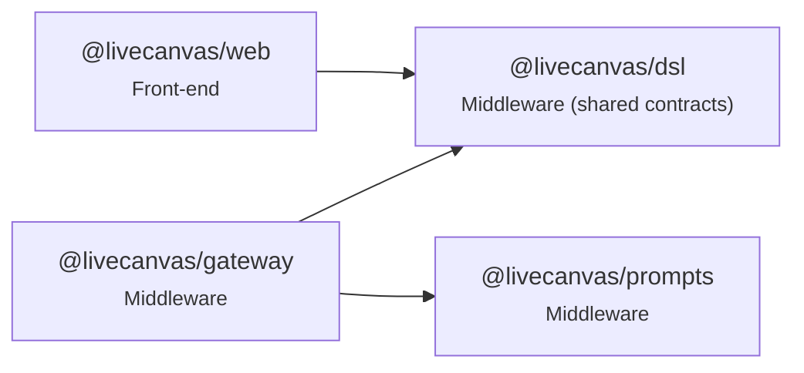

# Code map

_Generated from the TypeScript AST by `pnpm codemap` — do not edit by hand; CI runs `pnpm codemap --check`._

| Measure | Count |
|---|---|
| Modules | 34 |
| Lines | 1968 |
| Top-level symbols | 169 |
| Exported symbols | 86 |
| Exported names defined in 2+ modules | 0 |

## Package dependency graph

| Package | External runtime imports |
|---|---|
| @livecanvas/dsl | `zod` |
| @livecanvas/prompts | — |
| @livecanvas/gateway | `@fastify/cors`, `@fastify/websocket`, `fastify`, `postgres`, `undici`, `ws`, `zod` |
| @livecanvas/web | `lucide-react`, `next`, `react`, `zustand` |

## Modules and exported symbols

### @livecanvas/dsl — Middleware (shared contracts)

| Module | LOC | Exports (kind) |
|---|---|---|
| [compact.ts](../packages/dsl/src/compact.ts) | 143 | `SHORT_KEYS` const · `CompactContext` interface · `CompactParseError` class · `expandCompact` function · `serializeCompact` function |
| [doc.ts](../packages/dsl/src/doc.ts) | 63 | `DesignNode` interface · `NodeId` const · `DesignNodeSchema` const · `DesignDocSchema` const · `DesignDoc` type · `emptyDoc` function · `findNode` function |
| [fixtures.ts](../packages/dsl/src/fixtures.ts) | 41 | `kitchenSinkDoc` const |
| [index.ts](../packages/dsl/src/index.ts) | 9 | — |
| [intent.ts](../packages/dsl/src/intent.ts) | 50 | `IntentAction` const · `Intent` const · `Intent` type · `IntentHeader` const · `IntentHeader` type · `DELTA_WEIGHTS` const · `deltaScore` function |
| [ops.ts](../packages/dsl/src/ops.ts) | 84 | `PatchOp` const · `PatchOp` type · `applyOp` function · `invertOp` function |
| [primitives.ts](../packages/dsl/src/primitives.ts) | 86 | `PRIMITIVE_TYPES` const · `PrimitiveType` const · `PrimitiveType` type · `propSchemas` const · `CONTAINER_TYPES` const · `PRIMARY_TEXT_PROP` const |
| [tokens.ts](../packages/dsl/src/tokens.ts) | 30 | `ColorToken` const · `SpaceToken` const · `RadiusToken` const · `ColorToken` type · `SpaceToken` type · `RadiusToken` type · `TokenSet` const · `TokenSet` type · `defaultTokens` const |
| [ws.ts](../packages/dsl/src/ws.ts) | 45 | `SttGrant` const · `SttGrant` type · `ClientMsg` const · `ClientMsg` type · `ServerMsg` const · `ServerMsg` type |

### @livecanvas/prompts — Middleware

| Module | LOC | Exports (kind) |
|---|---|---|
| [index.ts](../packages/prompts/src/index.ts) | 31 | `Prompt` interface · `PromptName` type · `loadPrompt` function |

### @livecanvas/gateway — Middleware

| Module | LOC | Exports (kind) |
|---|---|---|
| [bench/align.ts](../apps/gateway/src/bench/align.ts) | 27 | — |
| [bench/bakeoff.ts](../apps/gateway/src/bench/bakeoff.ts) | 126 | `pcmFromWav` function |
| [config.ts](../apps/gateway/src/config.ts) | 29 | `Config` type · `loadConfig` const |
| [db.ts](../apps/gateway/src/db.ts) | 11 | `getSql` function |
| [migrate.ts](../apps/gateway/src/migrate.ts) | 54 | — |
| [persist.ts](../apps/gateway/src/persist.ts) | 91 | `ANON_EMAIL` const · `Segment` interface · `Persistence` interface · `memoryPersistence` function · `pgPersistence` function |
| [server.ts](../apps/gateway/src/server.ts) | 121 | `Deps` interface · `defaultDeps` function · `buildServer` function |
| [spike.ts](../apps/gateway/src/spike.ts) | 271 | — |
| [stt/providers.ts](../apps/gateway/src/stt/providers.ts) | 150 | `SttSession` interface · `SttProvider` interface · `wsSession` function · `PROVIDERS` const |
| [sttGrant.ts](../apps/gateway/src/sttGrant.ts) | 31 | `FLUX_BROWSER_URL` const · `createSttGrant` function |

### @livecanvas/web — Front-end

| Module | LOC | Exports (kind) |
|---|---|---|
| [app/layout.tsx](../apps/web/app/layout.tsx) | 13 | `metadata` const · `RootLayout` function |
| [app/page.tsx](../apps/web/app/page.tsx) | 6 | `Home` function |
| [app/playground/page.tsx](../apps/web/app/playground/page.tsx) | 21 | `Playground` function |
| [app/studio/page.tsx](../apps/web/app/studio/page.tsx) | 53 | `Studio` function |
| [components/TranscriptStrip.tsx](../apps/web/components/TranscriptStrip.tsx) | 18 | `TranscriptStrip` function |
| [components/canvas/Canvas.tsx](../apps/web/components/canvas/Canvas.tsx) | 13 | `Canvas` function |
| [components/canvas/CanvasNode.tsx](../apps/web/components/canvas/CanvasNode.tsx) | 19 | `CanvasNode` const |
| [components/canvas/primitives.tsx](../apps/web/components/canvas/primitives.tsx) | 111 | `renderers` const |
| [components/canvas/tokens.ts](../apps/web/components/canvas/tokens.ts) | 16 | `tokenVars` function · `color` const · `space` const · `radius` const |
| [lib/voice/capture.ts](../apps/web/lib/voice/capture.ts) | 26 | `Capture` interface · `startCapture` function |
| [lib/voice/session.ts](../apps/web/lib/voice/session.ts) | 103 | `Transcript` interface · `VoiceEvents` interface · `startVoice` function |
| [next.config.ts](../apps/web/next.config.ts) | 15 | — |
| [store/doc.ts](../apps/web/store/doc.ts) | 24 | `useDoc` const |
| [store/voice.ts](../apps/web/store/voice.ts) | 37 | `useVoice` const |
