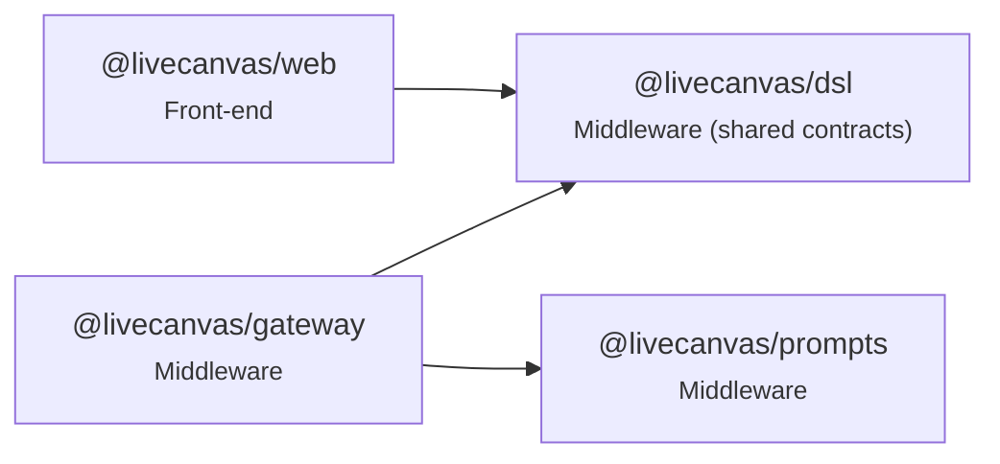

# Code map

_Generated from the TypeScript AST by `pnpm codemap` — do not edit by hand; CI runs `pnpm codemap --check`._

| Measure | Count |
|---|---|
| Modules | 50 |
| Lines | 4823 |
| Top-level symbols | 366 |
| Exported symbols | 178 |
| Exported names defined in 2+ modules | 1 |

## Package dependency graph

| Package | External runtime imports |
|---|---|
| @livecanvas/dsl | `zod` |
| @livecanvas/prompts | — |
| @livecanvas/gateway | `@fastify/cors`, `@fastify/websocket`, `fastify`, `postgres`, `undici`, `ws`, `zod` |
| @livecanvas/web | `@/lib`, `lucide-react`, `next`, `react`, `zustand` |

## Modules and exported symbols

### @livecanvas/dsl — Middleware (shared contracts)

| Module | LOC | Exports (kind) |
|---|---|---|
| [compact.ts](../packages/dsl/src/compact.ts) | 162 | `SHORT_KEYS` const · `CompactContext` interface · `CompactParseError` class · `expandCompact` function · `serializeCompact` function |
| [doc.ts](../packages/dsl/src/doc.ts) | 129 | `DesignNode` interface · `NodeId` const · `DesignNodeSchema` const · `DesignDocSchema` const · `DesignDoc` type · `DocKind` const · `DocKind` type · `docKind` const · `LANES` const · `emptyRoot` function · `emptyDoc` function · `isBlank` function · `findNode` function |
| [features.ts](../packages/dsl/src/features.ts) | 28 | `FEATURES` const · `FeatureKey` const · `FeatureKey` type · `Flags` const · `Flags` type · `defaultFlags` const · `kindFeature` const |
| [fixtures.ts](../packages/dsl/src/fixtures.ts) | 99 | `kitchenSinkDoc` const · `architectureDoc` const · `erdDoc` const · `sequenceDoc` const |
| [index.ts](../packages/dsl/src/index.ts) | 13 | — |
| [intent.ts](../packages/dsl/src/intent.ts) | 68 | `IntentAction` const · `Intent` const · `Intent` type · `IntentHeader` const · `IntentHeader` type · `DELTA_WEIGHTS` const · `deltaScore` function · `parseHeader` function |
| [layout.ts](../packages/dsl/src/layout.ts) | 329 | `Rect` interface · `EdgeStyle` type · `EndMark` type · `EdgeRoute` interface · `LaneBox` interface · `Lifeline` interface · `DiagramLayout` interface · `ARCH` const · `ERD` const · `SEQ` const · `layoutDiagram` function · `simplify` function · `labelPoint` function · `roundedPath` function |
| [lexicon.ts](../packages/dsl/src/lexicon.ts) | 372 | `LexiconResult` interface · `occurrenceKeys` function · `isModifier` const · `lexTokens` const · `kindKey` function · `lexicon` function · `requestedKind` function · `VocabEntry` interface · `diagramVocabulary` function |
| [ops.ts](../packages/dsl/src/ops.ts) | 111 | `PatchOp` const · `PatchOp` type · `applyOp` function · `invertOp` function |
| [primitives.ts](../packages/dsl/src/primitives.ts) | 129 | `SCREEN_TYPES` const · `DIAGRAM_TYPES` const · `PRIMITIVE_TYPES` const · `PrimitiveType` const · `PrimitiveType` type · `DiagramKind` const · `DiagramKind` type · `Tier` const · `Tier` type · `NodeKind` const · `NodeKind` type · `ColumnSpec` const · `propSchemas` const · `CONTAINER_TYPES` const · `PARENTS` const · `PRIMARY_TEXT_PROP` const · `ARRAY_PROPS` const |
| [tokens.ts](../packages/dsl/src/tokens.ts) | 30 | `ColorToken` const · `SpaceToken` const · `RadiusToken` const · `ColorToken` type · `SpaceToken` type · `RadiusToken` type · `TokenSet` const · `TokenSet` type · `defaultTokens` const |
| [vocabulary.ts](../packages/dsl/src/vocabulary.ts) | 57 | `VocabNode` const · `VocabNode` type · `VocabTerm` const · `VocabTerm` type · `KIND_WORDS` const · `parseDefine` function · `isVocabCommand` const · `isConfirm` const |
| [ws.ts](../packages/dsl/src/ws.ts) | 77 | `SttGrant` const · `SttGrant` type · `ClientMsg` const · `ClientMsg` type · `OpOrigin` const · `OpOrigin` type · `ServerMsg` const · `ServerMsg` type |

### @livecanvas/prompts — Middleware

| Module | LOC | Exports (kind) |
|---|---|---|
| [index.ts](../packages/prompts/src/index.ts) | 31 | `Prompt` interface · `PromptName` type · `loadPrompt` function |

### @livecanvas/gateway — Middleware

| Module | LOC | Exports (kind) |
|---|---|---|
| [bench/align.ts](../apps/gateway/src/bench/align.ts) | 27 | — |
| [bench/bakeoff.ts](../apps/gateway/src/bench/bakeoff.ts) | 126 | `pcmFromWav` function |
| [config.ts](../apps/gateway/src/config.ts) | 35 | `Config` type · `loadConfig` const |
| [db.ts](../apps/gateway/src/db.ts) | 11 | `getSql` function |
| [engine/docSession.ts](../apps/gateway/src/engine/docSession.ts) | 568 | `EngineConfig` interface · `Tunables` interface · `DEFAULT_TUNABLES` const · `DocSession` class |
| [engine/model.ts](../apps/gateway/src/engine/model.ts) | 113 | `ModelLine` interface · `ModelStream` interface · `ModelClient` type · `anthropicClient` function · `hedgedClient` function |
| [flags.ts](../apps/gateway/src/flags.ts) | 28 | `FlagService` class |
| [migrate.ts](../apps/gateway/src/migrate.ts) | 70 | — |
| [persist.ts](../apps/gateway/src/persist.ts) | 252 | `ANON_EMAIL` const · `Segment` interface · `VersionRow` interface · `OpenedSession` interface · `Persistence` interface · `FeatureAction` type · `memoryPersistence` function · `pgPersistence` function |
| [server.ts](../apps/gateway/src/server.ts) | 257 | `Deps` interface · `defaultDeps` function · `buildServer` function |
| [spike.ts](../apps/gateway/src/spike.ts) | 271 | — |
| [stt/providers.ts](../apps/gateway/src/stt/providers.ts) | 161 | `SttMeta` interface · `SttSession` interface · `SttProvider` interface · `wsSession` function · `PROVIDERS` const |
| [sttGrant.ts](../apps/gateway/src/sttGrant.ts) | 31 | `FLUX_BROWSER_URL` const · `createSttGrant` function |

### @livecanvas/web — Front-end

| Module | LOC | Exports (kind) |
|---|---|---|
| [app/admin/layout.tsx](../apps/web/app/admin/layout.tsx) | 7 | `metadata` const · `AdminLayout` function |
| [app/admin/page.tsx](../apps/web/app/admin/page.tsx) | 91 | `Admin` function |
| [app/layout.tsx](../apps/web/app/layout.tsx) | 13 | `metadata` const · `RootLayout` function |
| [app/page.tsx](../apps/web/app/page.tsx) | 6 | `Home` function |
| [app/playground/page.tsx](../apps/web/app/playground/page.tsx) | 29 | `Playground` function |
| [app/studio/page.tsx](../apps/web/app/studio/page.tsx) | 125 | `Studio` function |
| [components/Hud.tsx](../apps/web/components/Hud.tsx) | 60 | `Hud` function |
| [components/KeywordRail.tsx](../apps/web/components/KeywordRail.tsx) | 80 | `KeywordRail` function |
| [components/TranscriptStrip.tsx](../apps/web/components/TranscriptStrip.tsx) | 18 | `TranscriptStrip` function |
| [components/canvas/Canvas.tsx](../apps/web/components/canvas/Canvas.tsx) | 15 | `Canvas` function |
| [components/canvas/CanvasNode.tsx](../apps/web/components/canvas/CanvasNode.tsx) | 19 | `CanvasNode` const |
| [components/canvas/primitives.tsx](../apps/web/components/canvas/primitives.tsx) | 111 | `renderers` const |
| [components/canvas/tokens.ts](../apps/web/components/canvas/tokens.ts) | 16 | `tokenVars` function · `color` const · `space` const · `radius` const |
| [components/diagram/DiagramCanvas.tsx](../apps/web/components/diagram/DiagramCanvas.tsx) | 200 | `DiagramCanvas` function |
| [lib/gateway.ts](../apps/web/lib/gateway.ts) | 63 | `WS_URL` const · `HTTP_BASE` const · `gateway` const |
| [lib/metricsTap.ts](../apps/web/lib/metricsTap.ts) | 78 | `currentMaxReflows` const · `installMetricsTap` function · `tapLocalTranscript` function |
| [lib/voice/capture.ts](../apps/web/lib/voice/capture.ts) | 26 | `Capture` interface · `startCapture` function |
| [lib/voice/session.ts](../apps/web/lib/voice/session.ts) | 110 | `Transcript` interface · `VoiceEvents` interface · `startVoice` function |
| [next.config.ts](../apps/web/next.config.ts) | 15 | — |
| [store/doc.ts](../apps/web/store/doc.ts) | 50 | `JobState` interface · `useDoc` const |
| [store/features.ts](../apps/web/store/features.ts) | 34 | `useFeatures` const |
| [store/metrics.ts](../apps/web/store/metrics.ts) | 35 | `useMetrics` const · `pct` const · `dollarsFor` const |
| [store/voice.ts](../apps/web/store/voice.ts) | 37 | `useVoice` const |

## Duplicate exported names

- `metadata`: apps/web/app/admin/layout.tsx, apps/web/app/layout.tsx
