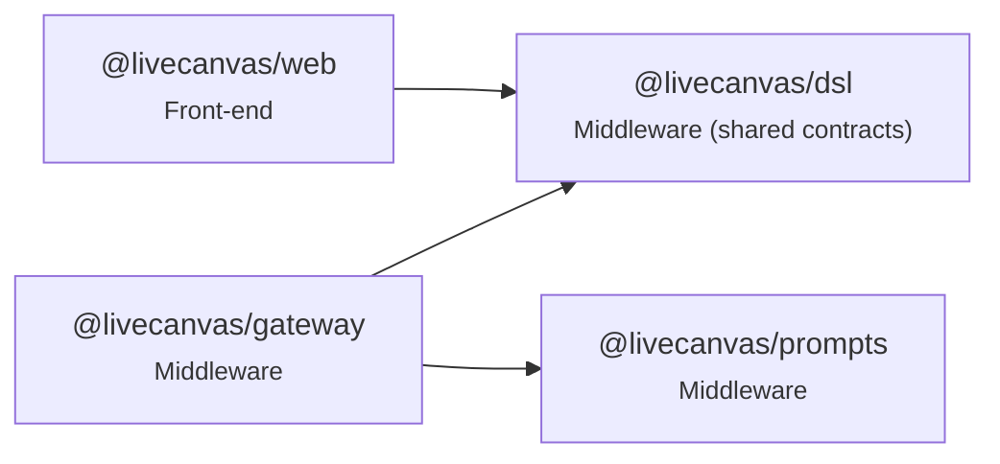

# Code map

_Generated from the TypeScript AST by `pnpm codemap` — do not edit by hand; CI runs `pnpm codemap --check`._

| Measure | Count |
|---|---|
| Modules | 77 |
| Lines | 8847 |
| Top-level symbols | 605 |
| Exported symbols | 280 |
| Exported names defined in 2+ modules | 3 |

## Package dependency graph

| Package | External runtime imports |
|---|---|
| @livecanvas/dsl | `zod` |
| @livecanvas/prompts | — |
| @livecanvas/gateway | `@fastify/cors`, `@fastify/websocket`, `fastify`, `postgres`, `undici`, `ws`, `zod` |
| @livecanvas/web | `@/components`, `@/lib`, `lucide-react`, `next`, `react`, `zustand` |

## Modules and exported symbols

### @livecanvas/dsl — Middleware (shared contracts)

| Module | LOC | Exports (kind) |
|---|---|---|
| [compact.ts](../packages/dsl/src/compact.ts) | 163 | `SHORT_KEYS` const · `CompactContext` interface · `CompactParseError` class · `expandCompact` function · `serializeCompact` function |
| [doc.ts](../packages/dsl/src/doc.ts) | 219 | `DesignNode` interface · `NodeId` const · `DesignNodeSchema` const · `DesignDocSchema` const · `DesignDoc` type · `DocKind` const · `DocKind` type · `docKind` const · `VIEWS` const · `viewIndex` const · `emptyView` const · `emptyProject` function · `toProject` function · `viewDoc` function · `withView` function · `toProjectPath` const · `fromProjectPath` function · `viewCount` function · `LANES` const · `emptyRoot` function · `emptyDoc` function · `isBlank` function · `findNode` function |
| [features.ts](../packages/dsl/src/features.ts) | 52 | `FEATURES` const · `FeatureKey` const · `FeatureKey` type · `Flags` const · `Flags` type · `defaultFlags` const · `kindFeature` const |
| [fixtures.ts](../packages/dsl/src/fixtures.ts) | 99 | `kitchenSinkDoc` const · `architectureDoc` const · `erdDoc` const · `sequenceDoc` const |
| [index.ts](../packages/dsl/src/index.ts) | 16 | — |
| [intent.ts](../packages/dsl/src/intent.ts) | 68 | `IntentAction` const · `Intent` const · `Intent` type · `IntentHeader` const · `IntentHeader` type · `DELTA_WEIGHTS` const · `deltaScore` function · `parseHeader` function |
| [layout.ts](../packages/dsl/src/layout.ts) | 420 | `Rect` interface · `EdgeStyle` type · `EndMark` type · `EdgeRoute` interface · `LaneBox` interface · `Lifeline` interface · `DiagramLayout` interface · `ARCH` const · `ERD` const · `CON` const · `CVA` const · `SEQ` const · `layoutDiagram` function · `utilization` function · `fmtRate` const · `QUADRANTS` const · `simplify` function · `labelPoint` function · `roundedPath` function |
| [lexicon.ts](../packages/dsl/src/lexicon.ts) | 558 | `LexiconResult` interface · `occurrenceKeys` function · `COLOR` const · `isModifier` const · `lexTokens` const · `kindKey` function · `lexicon` function · `requestedKind` function · `VocabEntry` interface · `diagramVocabulary` function · `refreshProvisional` function · `fixSpeech` function · `lexiconWords` function |
| [ops.ts](../packages/dsl/src/ops.ts) | 116 | `PatchOp` const · `PatchOp` type · `applyOp` function · `invertOp` function · `mapOpPaths` function |
| [prd.ts](../packages/dsl/src/prd.ts) | 118 | `compilePrd` function · `prdCoverage` const |
| [primitives.ts](../packages/dsl/src/primitives.ts) | 143 | `SCREEN_TYPES` const · `DIAGRAM_TYPES` const · `PRIMITIVE_TYPES` const · `PrimitiveType` const · `PrimitiveType` type · `DiagramKind` const · `DiagramKind` type · `Tier` const · `Tier` type · `NodeKind` const · `NodeKind` type · `ColumnSpec` const · `propSchemas` const · `CONTAINER_TYPES` const · `PARENTS` const · `PRIMARY_TEXT_PROP` const · `ARRAY_PROPS` const |
| [scaffold.ts](../packages/dsl/src/scaffold.ts) | 154 | `ScaffoldStep` interface · `takeOver` function · `scaffold` function |
| [suggest.ts](../packages/dsl/src/suggest.ts) | 163 | `colType` function · `ruleSuggestions` function · `isSuggestionCommand` const · `isSaveCommand` const · `parseSave` function · `Resolution` interface · `resolveCommand` function |
| [tokens.ts](../packages/dsl/src/tokens.ts) | 38 | `ColorToken` const · `LIGHT_FILLS` const · `SpaceToken` const · `RadiusToken` const · `ColorToken` type · `SpaceToken` type · `RadiusToken` type · `TokenSet` const · `TokenSet` type · `defaultTokens` const |
| [vocabulary.ts](../packages/dsl/src/vocabulary.ts) | 60 | `VocabNode` const · `VocabNode` type · `VocabTerm` const · `VocabTerm` type · `KIND_WORDS` const · `parseDefine` function · `isVocabCommand` const · `isConfirm` const |
| [ws.ts](../packages/dsl/src/ws.ts) | 147 | `SttGrant` const · `SttGrant` type · `PROTOCOL` const · `ShareToken` const · `SharedDoc` const · `SharedDoc` type · `ClientMsg` const · `ClientMsg` type · `OpOrigin` const · `OpOrigin` type · `WordMark` const · `Suggestion` const · `Suggestion` type · `WordMark` type · `VersionSummary` const · `VersionSummary` type · `ServerMsg` const · `ServerMsg` type |

### @livecanvas/prompts — Middleware

| Module | LOC | Exports (kind) |
|---|---|---|
| [index.ts](../packages/prompts/src/index.ts) | 31 | `Prompt` interface · `PromptName` type · `loadPrompt` function |

### @livecanvas/gateway — Middleware

| Module | LOC | Exports (kind) |
|---|---|---|
| [access.ts](../apps/gateway/src/access.ts) | 22 | `Purpose` type · `mintAccess` function · `verifyAccess` function |
| [bench/align.ts](../apps/gateway/src/bench/align.ts) | 27 | — |
| [bench/bakeoff.ts](../apps/gateway/src/bench/bakeoff.ts) | 126 | `pcmFromWav` function |
| [bench/jev.ts](../apps/gateway/src/bench/jev.ts) | 202 | — |
| [config.ts](../apps/gateway/src/config.ts) | 41 | `Config` type · `loadConfig` const |
| [db.ts](../apps/gateway/src/db.ts) | 11 | `getSql` function |
| [demo.ts](../apps/gateway/src/demo.ts) | 85 | `DemoLine` interface · `DEMO_SCRIPT` const · `DEMO_VOICES` const · `DemoVoice` type · `DemoWord` interface · `DemoManifestLine` interface · `DemoManifest` interface · `alignWords` function · `demoAudio` function |
| [engine/decisions.ts](../apps/gateway/src/engine/decisions.ts) | 253 | `CHOICE_MIN` const · `NOUL_YES` const · `NOUL_NO` const · `Mention` interface · `mentions` function · `Plan` interface · `ownedBy` const · `readable` const · `planDecisions` function · `Decided` interface · `decisionsToLines` function |
| [engine/docSession.ts](../apps/gateway/src/engine/docSession.ts) | 1323 | `EngineConfig` interface · `Tunables` interface · `DEFAULT_TUNABLES` const · `DocSession` class |
| [engine/jev.ts](../apps/gateway/src/engine/jev.ts) | 39 | `JevQuestion` type · `JevAnswer` type · `JevResult` interface · `JevClient` type · `typesafeJev` function |
| [engine/model.ts](../apps/gateway/src/engine/model.ts) | 120 | `ModelLine` interface · `ModelStream` interface · `ModelClient` type · `anthropicClient` function · `hedgedClient` function |
| [flags.ts](../apps/gateway/src/flags.ts) | 29 | `FlagService` class |
| [migrate.ts](../apps/gateway/src/migrate.ts) | 72 | — |
| [persist.ts](../apps/gateway/src/persist.ts) | 388 | `ANON_EMAIL` const · `Segment` interface · `VersionRow` interface · `OpenedSession` interface · `ProjectRow` interface · `FlagChange` interface · `projectMeta` function · `Persistence` interface · `FeatureAction` type · `memoryPersistence` function · `pgPersistence` function |
| [server.ts](../apps/gateway/src/server.ts) | 543 | `Deps` interface · `defaultDeps` function · `buildServer` function |
| [spike.ts](../apps/gateway/src/spike.ts) | 271 | — |
| [stt/providers.ts](../apps/gateway/src/stt/providers.ts) | 161 | `SttMeta` interface · `SttSession` interface · `SttProvider` interface · `wsSession` function · `PROVIDERS` const |
| [sttGrant.ts](../apps/gateway/src/sttGrant.ts) | 31 | `FLUX_BROWSER_URL` const · `createSttGrant` function |

### @livecanvas/web — Front-end

| Module | LOC | Exports (kind) |
|---|---|---|
| [app/admin/layout.tsx](../apps/web/app/admin/layout.tsx) | 7 | `metadata` const · `AdminLayout` function |
| [app/admin/page.tsx](../apps/web/app/admin/page.tsx) | 117 | `Admin` function |
| [app/api/access-token/route.ts](../apps/web/app/api/access-token/route.ts) | 11 | `GET` function |
| [app/api/demo-token/route.ts](../apps/web/app/api/demo-token/route.ts) | 13 | `GET` function |
| [app/api/enter/route.ts](../apps/web/app/api/enter/route.ts) | 29 | `POST` function |
| [app/demo/page.tsx](../apps/web/app/demo/page.tsx) | 129 | `Demo` function |
| [app/layout.tsx](../apps/web/app/layout.tsx) | 13 | `metadata` const · `RootLayout` function |
| [app/p/[id]/page.tsx](../apps/web/app/p/[id]/page.tsx) | 40 | `ReadOnlyProject` function |
| [app/page.tsx](../apps/web/app/page.tsx) | 97 | `Home` function |
| [app/playground/page.tsx](../apps/web/app/playground/page.tsx) | 30 | `Playground` function |
| [app/s/[token]/layout.tsx](../apps/web/app/s/[token]/layout.tsx) | 8 | `metadata` const · `SharedLayout` function |
| [app/s/[token]/page.tsx](../apps/web/app/s/[token]/page.tsx) | 71 | `Shared` function |
| [app/studio/page.tsx](../apps/web/app/studio/page.tsx) | 224 | `Studio` function |
| [components/FeaturesPopover.tsx](../apps/web/components/FeaturesPopover.tsx) | 33 | `FeaturesPopover` function |
| [components/Hud.tsx](../apps/web/components/Hud.tsx) | 60 | `Hud` function |
| [components/IntakeCard.tsx](../apps/web/components/IntakeCard.tsx) | 38 | `IntakeCard` function |
| [components/KeywordRail.tsx](../apps/web/components/KeywordRail.tsx) | 82 | `KeywordRail` function |
| [components/PrdDrawer.tsx](../apps/web/components/PrdDrawer.tsx) | 55 | `Markdown` function · `PrdDrawer` function |
| [components/ProjectsModal.tsx](../apps/web/components/ProjectsModal.tsx) | 58 | `ProjectsModal` function |
| [components/SharePopover.tsx](../apps/web/components/SharePopover.tsx) | 60 | `SharePopover` function |
| [components/SuggestionTray.tsx](../apps/web/components/SuggestionTray.tsx) | 35 | `SuggestionTray` function |
| [components/TranscriptStrip.tsx](../apps/web/components/TranscriptStrip.tsx) | 63 | `TranscriptStrip` function |
| [components/VersionTimeline.tsx](../apps/web/components/VersionTimeline.tsx) | 56 | `VersionTimeline` function |
| [components/ViewGrid.tsx](../apps/web/components/ViewGrid.tsx) | 46 | `ViewGrid` function |
| [components/canvas/Canvas.tsx](../apps/web/components/canvas/Canvas.tsx) | 18 | `Canvas` function |
| [components/canvas/CanvasNode.tsx](../apps/web/components/canvas/CanvasNode.tsx) | 19 | `CanvasNode` const |
| [components/canvas/FitBox.tsx](../apps/web/components/canvas/FitBox.tsx) | 31 | `FitBox` function |
| [components/canvas/primitives.tsx](../apps/web/components/canvas/primitives.tsx) | 112 | `renderers` const |
| [components/canvas/tokens.ts](../apps/web/components/canvas/tokens.ts) | 16 | `tokenVars` function · `color` const · `space` const · `radius` const |
| [components/diagram/DiagramCanvas.tsx](../apps/web/components/diagram/DiagramCanvas.tsx) | 341 | `DiagramCanvas` function |
| [lib/access.ts](../apps/web/lib/access.ts) | 30 | `getAccess` function · `authedFetch` function |
| [lib/gateway.ts](../apps/web/lib/gateway.ts) | 111 | `WS_URL` const · `HTTP_BASE` const · `gateway` const · `demoGateway` const |
| [lib/metricsTap.ts](../apps/web/lib/metricsTap.ts) | 89 | `currentMaxReflows` const · `installMetricsTap` function · `tapLocalTranscript` function |
| [lib/token.ts](../apps/web/lib/token.ts) | 32 | `Purpose` type · `mint` function · `same` function · `verify` function · `COOKIE` const |
| [lib/voice/capture.ts](../apps/web/lib/voice/capture.ts) | 26 | `Capture` interface · `startCapture` function |
| [lib/voice/session.ts](../apps/web/lib/voice/session.ts) | 111 | `Transcript` interface · `VoiceEvents` interface · `startVoice` function |
| [middleware.ts](../apps/web/middleware.ts) | 19 | `config` const · `middleware` function |
| [next.config.ts](../apps/web/next.config.ts) | 15 | — |
| [store/doc.ts](../apps/web/store/doc.ts) | 55 | `JobState` interface · `useDoc` const |
| [store/features.ts](../apps/web/store/features.ts) | 62 | `useFeatures` const |
| [store/metrics.ts](../apps/web/store/metrics.ts) | 35 | `useMetrics` const · `pct` const · `dollarsFor` const |
| [store/voice.ts](../apps/web/store/voice.ts) | 41 | `useVoice` const |

## Duplicate exported names

- `Purpose`: apps/gateway/src/access.ts, apps/web/lib/token.ts
- `metadata`: apps/web/app/admin/layout.tsx, apps/web/app/layout.tsx, apps/web/app/s/[token]/layout.tsx
- `GET`: apps/web/app/api/access-token/route.ts, apps/web/app/api/demo-token/route.ts
